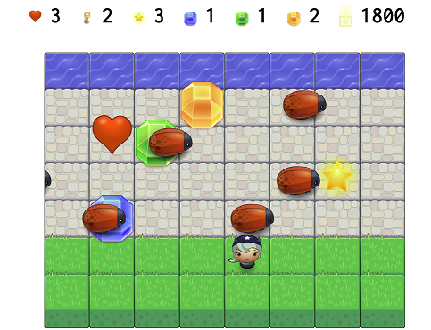

Classic Arcade Game Clone 2017
===============================

In this game you have a Player and Enemies (Bugs). The goal of the player is to collect items and get points, without colliding into any one of the enemies.

## Table of Contents

* [Link to a game on github Pages](#game-link)
* [Game Preview](#game-preview)
* [Description of original game on Wikipedia](#from-wikipedia-the-free-encyclopedia)
* [Game implementation](#implementation)
* [Technology used](#technology-used)
* [Thank you](#thank-you)

## Game link

https://igor333m.github.io/arcadegame/

## Game preview

## From Wikipedia, the free encyclopedia

Original [Frogger game](https://en.wikipedia.org/wiki/Frogger) on Wikipedia.

## Implementation

 The goal of the player is to collect items and get points, without colliding into any one of the enemies. The player can move left, right, up and down. The enemies move in varying speeds on the paved block portion of the scene. Once a the player collides with an enemy, loses one health and moves back to the start square. Player can collect different items to get points. Game is over when player lose all heath.

## Technology used

This game is build using HTML, CSS, JavaScript, jQuery, jQuery Transit plugin and HTML Canvas.
http://ricostacruz.com/jquery.transit/

## Thank you

# Udacity 

For this amazing experience